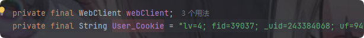
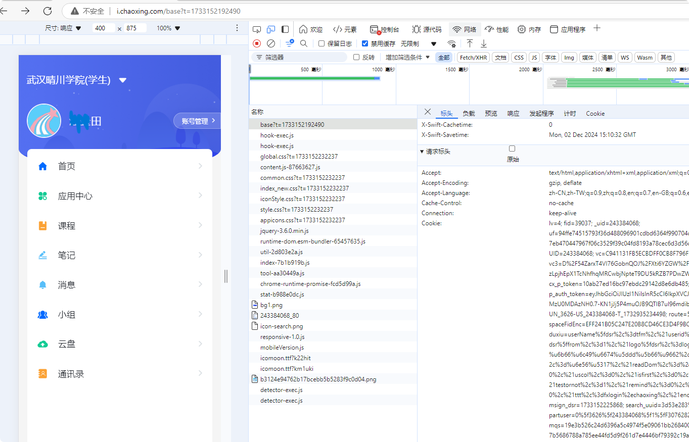
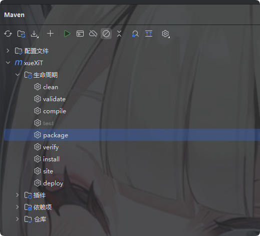
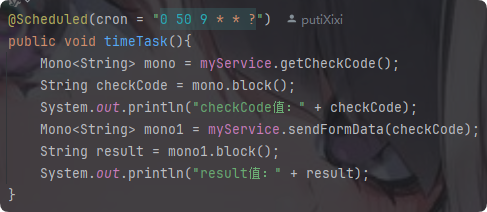

在 https://github.com/sh1SuTa/xueXiT/blob/ea3ebf0cfcf7fb6cefd0354144e86cf5f0555826/src/main/java/com/putileaf/xuexit/MyService.java
中填写你的Cookie
 

如何获取Cookie，
打开浏览器F12登录即可

如何打包？
使用idea打开maven项目

package为jar包，在target目录下

然后部署到你的电脑或者服务器上都行，最好是24小时不间断的运行，

如何修改定时？
在 https://github.com/sh1SuTa/xueXiT/blob/master/src/main/java/com/putileaf/xuexit/service/TimeService.java 
中

 
 0  50   9    *   *       ？   
 秒  分   时  每天 每月 不指定具体的星期几
 

克隆仓库
git clone https://github.com/sh1SuTa/xueXiT.git